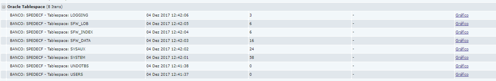

O Zabbix é uma ferramenta consolidada no monitoramento de infraestrutura de TI. Um dos recursos mais interessante do Zabbix é a descoberta (discovery) de informação automaticamente, utilizando um recurso chamado LLD.

Para o monitoramento de banco de dados Oracle, o Zabbix já possui uma série de plugins, tais como:

- *Orabbix*
- *Dababix*
- *PyOra*

Porém devido a uma particularidade do cliente, nenhum desses plugins poderiam ser utilizados para o monitoramento das tablespace do Oracle e seria necessário criar a minha própria forma de monitoramento.

Com essa oportunidade decidi utilizar o LLD devido a grande quantidade de banco de dados e um total de mais de 250 tablespaces.

Para o funcionamento do LLD é necessário que o Zabbix receba as informações no padrão JSON, dessa forma foi criado a seguinte estrutura:

```json
{
 "data":[
             {
               "{#NAME}": "SYSTEMS",
               "{#USED}": "42",
              }
          ]
}
```

Na chave `{#NAME}` é atribuída o nome da tablespace e na chave `{#USED}` é atribuída a porcentagem de utilização.

# Desenvolvimento do Script

O script abaixo executa uma query no banco de dados Oracle que retorna todas as tablespace e transforma essa informação no padrão JSON. Por questão de política de segurança, todos os scripts de conexão com o  banco foram criados no S.O do banco de dados.

Os scripts apresentados foram salvos no diretório /etc/zabbix/script/.

```python
#!/usr/bin/python
# -*- coding: utf-8 -*-

'''
FileName: tablespace_discovery.py
Script para levantamento da tablespace do oracle para monitoramento LLD do Zabbix
Autor: Clodonil Honorio Trigo
Email: clodonil@nisled.org
Data: 29/11/2017
'''

import sys
import subprocess
import json

def conexao(user,passwd,banco):
       command="/etc/zabbix/script/select_tablespace.sh {0} {1} {2}".format(user,passwd,banco)
       run = subprocess.Popen(command, stdout=subprocess.PIPE, shell=True)
       (result, err) = run.communicate()
       return result

def gerar_json(txt,db):
       estrutura = {"data": []}
       base = txt.split(';')
       for tablespace in base[:-1]:
              (nome,used) = tablespace.split(',')
              estrutura['data'].append({
                           "{#NAME}": nome.replace(' ','').replace('Name:',''),
                           "{#USED}": used.replace(' ','').replace('Used:',''),
                           "{#DB}": db,
              })
       return(json.dumps(estrutura, indent=4))

def free_space(tablespace, result):
       for item in result.split(';'):
             (nome,used) = item.split(',')
             if nome.replace(' ','').replace('Name:','') == tablespace:
                 return used.replace(' ','').replace('Used:','')

if __name__ == '__main__':
        # User com permissao de conexao no banco de dados
        banco = sys.argv[2]
        flaq = sys.argv[1]
        user = "zabbix"
        passwd = "password"

        result = conexao(user,passwd, banco)
        if flaq == 'discovery':
            json = gerar_json(result,banco)
        elif flaq == 'free':
            tablespace = sys.argv[3]
            json = free_space(tablespace,result)
        
        print(json)
```

Para execução da query de retorno das tablespace foi necessário a utilização do sqlplus do oracle, executando um select para tablespace com auto incremento. Esse script é acionado pelo tablespace_discovery.py.

```bash

#! /bin/bash
# FileName: select_tablespace.sh
# Clodonil Honorio Trigo
# 27/11/2017
#
# script que retorna tablespace de banco de dados para o Zabbix
#

PATH=$PATH:$HOME/bin
export ORACLE_HOME=/u01/app/oracle/product/11.2.0.4/dbhome_1
export PATH=$ORACLE_HOME/bin:.:$PATH

#variavel
database=${3}
user=${1}
pass=${2}
database=${3}

#query

result=`sqlplus -s $user/$pass@$database &amp;amp;lt;&amp;amp;lt; EOF
set pagesize 0
set numf '9999999.99'
select
'Name: ' || a.tablespace_name || ',',
'Used: ' || round(100*(SUM(a.bytes)/1024/1024 - round(c."Free"/1024/1024))/(SUM(decode(b.maxextend, null, A.BYTES/1024/1024, b.maxextend*8192/1024/1024)))) || ';'"PRC"
from dba_data_files a, sys.filext$ b,
(SELECT d.tablespace_name , sum(nvl(c.bytes,0)) "Free" FROM dba_tablespaces d,DBA_FREE_SPACE c where d.tablespace_name = c.tablespace_name(+) group by d.tablespace_name) c
where a.file_id = b.file#(+)
and a.tablespace_name = c.tablespace_name
GROUP by a.tablespace_name, c."Free"/1024
order by round(100*(SUM(a.bytes)/1024/1024 - round(c."Free"/1024/1024))/(SUM(decode(b.maxextend, null, A.BYTES/1024/1024, b.maxextend*8192/1024/1024)))) desc;
EOF`

echo $result
```

Antes de executar o script é necessário a criação do usuário no banco de dados com permissão de consulta das tablespaces. O usuário e a senha devem ser alterados no script tablespace_discovery.py.

O script `tablespace_discovery.py` aceita os seguintes parâmetros:

- *discovery* : Essa opção retorna todas as tablespaces de um banco de dados;
- *free* : Essa opção retorna o espaço utilizado de uma tablespace especifica.

Um exemplo de execução para validação, assumindo que o nome do banco de dados é `banco1`, é mostrado logo abaixo.

```bash
$ /etc/zabbix/script/tablespace.discovery.py discovery BANCO1
```

Devemos ter como retorno:

```
{
 "data": [
 {
 "{#DB}": "BANCO1",
 "{#USED}": "58",
"{#NAME}": "SYSTEM"
},
{
"{#DB}": "BANCO1",
"{#USED}": "24",
"#NAME}": "SYSAUX"
},
{
"{#DB}": "BANCO1",
"{#USED}": "3",
"{#NAME}": "LOGGING"
},
]
}
```

Para obter a utilização da tablespace é passado como parâmetro o nome do banco e também da tablespace, conforme o exemplo abaixo:

```
$ /etc/zabbix/script/tablespace.discovery.py free BANCO1 SYSTEM
```

Devemos ter como retorno:

```
23
```

Sendo 23% de espaço utilizado.

Após a criação dos scripts e a suas validações, é necessário o ajustes do arquivo `/etc/zabbix/zabbix_agentd.conf` adicionando o script tablespace_discovery.py.

```php
UserParameter=oracle_tablespace[*],/etc/zabbix/script/tablespace_discovery.py $1 $2 $3
```

O último ajuste necessário é permitir que o usuário Zabbix utilize o sqlplus,  adicionar o usuário zabbix no grupo oinstall.

```bash
$ usermod -a -G oinstall zabbix
```
# Painel do Zabbix

Com a configuração do script finalizado, passamos para ajuste no painel do Zabbix para obter os valores das tablespaces e também para criação das trigger.

Cadastre o host do banco de dados Oracle, e click na opção "Regras de descoberta" e em seguida "Criar regra de descoberta".

Há regra de descoberta é necessário para obter todas as tablespace de um banco de dados. Para isso, é passado a chave oracle_tablespace com os parâmetros discovery e o nome do banco de dados, conforme a figura1.


Figura 1 - Cadastro da regra de decoberta

Com a criação da regra de descoberta, escolha a opção "Protótipos de itens" e click em "Criar  Protótipos de Itens".

Essa opção vai obter as porcentagens de utilização da tablespace. No campo chave é passado como parâmetro "free" juntamente com o nome do banco e o nome tablespace. O nome do banco e da tablespace são variáveis recorrentes da descoberta, conforme a figura 2.


Figura 2 - Regra de descoberta de Itens

O último item para ser configurado é a trigger que vai alarmar conforme a utilização da tablespace. Nesse caso, vai ser considerado "Desastre" quando o espaço livre da tablespace estiver abaixo de 5%.

Para isso click em "Protótipos de trigger" e logo em seguida "Criar protótipos de trigger", conforme a figura 3.


Figura 3 - Criação da triggers

Com isso temos as tablespaces do banco de dados Oracle sendo monitoradas e caso seja necessário adicionar um novo banco, o processo é bem simples no painel do Zabbix.

A figura 4, apresenta a forma que o Zabbix  mostra os dados recentes retornados.


Figura 4 - Dados recentes retornados

Na Figura 5, apresentado as trigger no estado normal


Figura 5 - Trigger