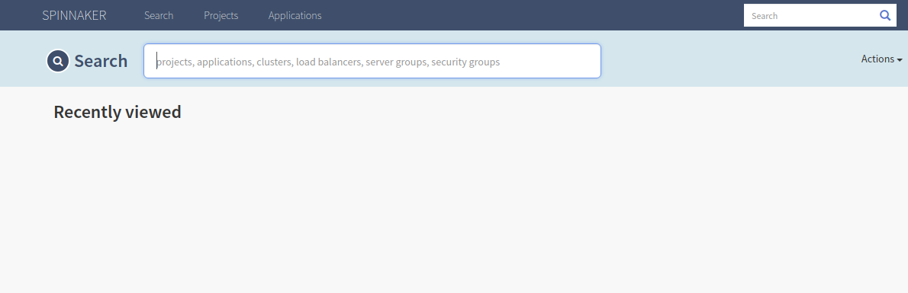
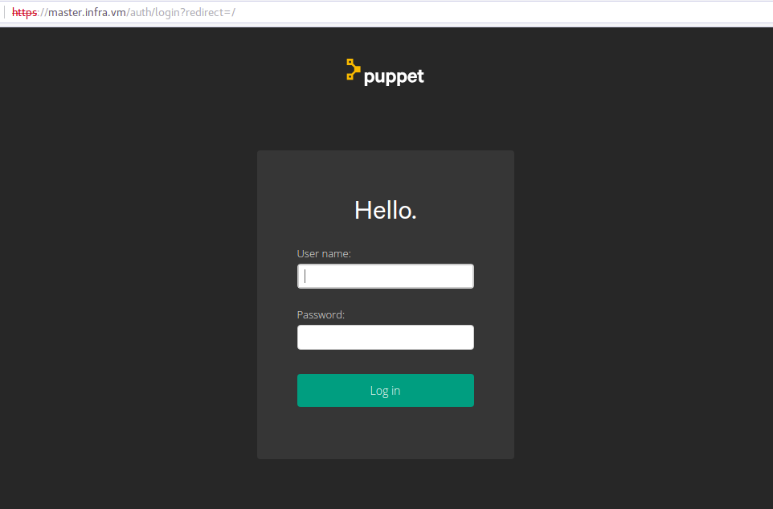

Vagrant é uma ferramenta com foco em automação para provisionar máquinas virtual em um processo simples e fácil. O Vagrant reduz o tempo de configuração.

## O que é o vagrant

 O Vagrant fornece ambientes de trabalho fáceis de configurar, reproduzíveis e portáteis, construídos sobre a tecnologia padrão do setor e controlados por um único fluxo de trabalho consistente para ajudar a maximizar a produtividade e a flexibilidade de você e de sua equipe.

Para alcançar sua magia, o Vagrant está nos ombros dos gigantes. As máquinas são provisionadas no topo do VirtualBox, VMware, AWS ou qualquer outro provedor. Em seguida, as ferramentas de provisionamento padrão do setor, como shell scripts, Chef ou Puppet, podem instalar e configurar automaticamente o software na máquina virtual.

## Vagrant no mundo DevOps

Se você é engenheiro de operações ou engenheiro de DevOps, a Vagrant oferece a você um ambiente descartável e um fluxo de trabalho consistente para desenvolver e testar scripts de gerenciamento de infraestrutura.

Você pode testar rapidamente as receitas feitas em scripts de shell, cookbooks Chef, módulos Puppet e muito mais usando virtualização local, como VirtualBox, KVM ou VMware.

Em seguida, com a mesma configuração, você pode testar esses scripts em providers como AWS, digitalocean, Google, com o mesmo fluxo de trabalho.

##  Comparação do Vagrant com o Terraform

 

## Providers

O Vagrant atualmente suporta os seguintes providers:

- VirtualBox
- Hyper-V
- VMWARE
- KVM
- Azure
- AWS
- Google
- digitalocean
- proxmox
- Openstack
- ...

## Images das VM (box)

Vagrant trabalha com imagens de sistemas operacionais pré-configurados que vão servir como base para a construção das VMs.

As imagens pode ser obtidas no repositório do vagrant cloud:
 
* [https://vagrantcloud.com](https://vagrantcloud.com)

 
Além deste, existe um base pública de boxes no site abaixo

* [http://www.vagrantbox.es](https://vagrantcloud.com)

Podemos realizar o download das imagens utilizando o seguinte comando:

``` 
$ vagrant box add generic/centos7
```

É possível personalizar uma imagens utilizado o software da HashiCorp Packer.


## VagrantFile

 

## Tecnologias de Provisionamentos

- Puppet
- Chef
- Salt
- Ansible
- CFEngine
- Shell (script)

## Vagrant Plugins

O Vagrant disponibiliza um conjunto de plugins para auxiliar no processo de provisionamento, disponibilizando uma série de recursos interessantes.

Como exemplo, podemos falar do plugin ```vagrant-hosts-provisioner```. Esse plugin é bem simples, basicamente configurado o arquivo de hosts de todas as máquinas envolvidas em um provisionamento.

Toda a lista de plugins podem ser obtidos no endereço:

* [https://github.com/hashicorp/vagrant/wiki/Available-Vagrant-Plugins](https://github.com/hashicorp/vagrant/wiki/Available-Vagrant-Plugins)

Utilizamos os seguintes comandos para instalar um plugins:

```
$ vagrant plugin install vagrant-hosts-provisioner
```

## Principais Comandos

A seguir um resumo dos principais comandos do vagrant: 

|Comandos | descrição|
|---------|-----------|
|vagrant init | Gera o arquivo de configuração|
|vagrant up   | Inicia/cria a VM |
|vagrant halt | Desliga a VM |
|vagrant reload | Recarrega uma VM (Reboot)|
|vagrant suspend | Suspende uma VM |
|vagrant resume | Resume uma VM suspensa |
|vagrant status | Retorna o status da VM |
|vagrant ssh | Acessa a VM |
|vagrant destroy | Apaga a VM |
|vagrant help | Ajuda com outros comandos|
 

## Laboratórios

Os laboratórios propóstos são basicamente para fortalezer os conhecimentos estudados e também para provar alguns conceitos básicos do Vagrant. 

### Instalação do Spinnaker com Vagrant

Nesse laboratório vamos instalar e configurar o Spinnaker utilizando o Vagrant.

Esse método é bastante interessante porque podemos recriar o spinnaker de forma rápida e a qualquer

Para criação desse laboratório, crie o arquivo Vagrantfile, conforme abaixo. Utilizei uma imagem do ubuntu. A quantidade de memória RAM e CPU podem ser ajustado. Estou seguindo a recomendação da documentação.

```
# -*- mode: ruby -*-
# vi: set ft=ruby :

#Vagrantfile
Vagrant.configure("2") do |config|
  config.vm.box = "ubuntu/xenial64"
  config.vm.network "private_network", ip: "192.168.33.10"
  config.vm.provider "virtualbox" do |vb|
    vb.memory = "8056"
    vb.cpus = 4
  config.vm.provider :virtualbox do |vb|
        vb.name = "spinnaker"
  end
end
  config.vm.provision "shell", path: "install-spinnaker.sh"
end
```
Toda a instalação e configuração do spinnaker será executada pelo script [install-spinnaker.sh](https://raw.githubusercontent.com/clodonil/LabsVagrant/master/spinnaker/install-spinnaker.sh).

O arquivo de posinstall ```install-spinnaker.sh``` deve estar no mesmo diretório do Vagrantfile.

Após colocar os arquivos no mesmo diretório, execute o comando para provisionar a VM e instalar o spinnaker.

```
$ vagrant up
```

Para finalizar, acesso a URL ```http://192.168.33.10:9000```, conforme a imagem.

.
)

### Instalação da infra Puppet Enterprise 2019 com Vagrant

Nesse laboratório vamos provisionar 3 servidores sendo eles:

   1. VM1: Puppet Enterprise 2019
   2. VM2: Gitlab/Gitlab-Runner
   3. VM3: Node1
   4. VM4: Devops-Tools

Nesse lab primeiro vamos provisionar o servidor do Puppet Enterprise e em seguida os outros servidores como nodes do Puppet Enterprise.

O arquivo Vagrantfile vai orquestrar o provisionamento dos servidores.

```
# -*- mode: ruby -*-
# vi: set ft=ruby :

Vagrant.configure("2") do |config|
  #  Configure base
  config.vm.box = 'centos/7'


  # Puppet Enterprise 2019 and Puppet Tasks
  config.vm.define "master" do |master|
      master.vm.hostname = "master.infra.vm"
      master.vm.network :private_network, :ip => "192.168.77.100"
      master.vm.provision :hosts, :sync_hosts => true

      # Start postInstall
      master.vm.provision "shell", path: "./PuppetServer/install.sh"

      #master.vm.provider :virtualbox do |setting|
      master.vm.provider :libvirt do |setting|
           setting.memory = 4028
           setting.cpus = 2
      end
   end

  # GitLab Server e Runner 
  config.vm.define "git" do |git|
      git.vm.hostname = "git.infra.vm"
      git.vm.network :private_network, :ip => "192.168.77.101"
      git.vm.provision :hosts, :sync_hosts => true


      # Start postInstall
         git.vm.provision "shell", path: "./runner/init.sh"

      #git.vm.provider :virtualbox do |setting|
      git.vm.provider :libvirt do |setting|
           setting.memory = 2048
           setting.cpus = 1
      end
   end

  # DevOps Tools 
  config.vm.define "devops" do |devops|
      devops.vm.hostname = "devops.infra.vm"
      devops.vm.provision :hosts, :sync_hosts => true
      devops.vm.network :private_network, :ip => "192.168.77.102"

      # Start postInstall
         devops.vm.provision "shell", inline: "curl -k https://master.infra.vm:8140/packages/current/install.bash | sudo bash"

      #master.vm.provider :virtualbox do |setting|
      devops.vm.provider :libvirt do |setting|
           setting.memory = 2048
           setting.cpus = 1
      end
   end

  # node1
  config.vm.define "node" do |node|
      node.vm.hostname = "node.infra.vm"
      node.vm.provision :hosts, :sync_hosts => true
      node.vm.network :private_network, :ip => "192.168.77.103"

      # Start postInstall
      node.vm.provision "shell", inline: "curl -k https://master.infra.vm:8140/packages/current/install.bash | sudo bash"

      #node.vm.provider :virtualbox do |setting|
      node.vm.provider :libvirt do |setting|
           setting.memory = 1024
           setting.cpus = 1
      end
   end
end   
```
 
 1. Primeiramente vamos provisionar o Master e a instalação do Puppet Enterprise 2019.
 ```
 $ vagrant up master
 ```

Assim que finalizar o provisionamento do Master, temos o PE 2019 rodando e pode ser acessado pelo endereço:

* http://192.168.77.100



O acesso:

```
user: root
passwd: redepp
```
Após finalizar o provisionamento do Puppet Enterprise, vamos provisonar as outras VMS:

```
$ vagrant up git devops node
```
Durante o provisionamento as VMs são incluidas no Puppet.


### Pipeline para receita de Puppet

