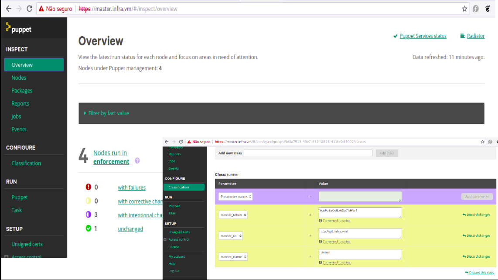

Vagrant é uma ferramenta com foco em automação para provisionar máquinas virtual em um processo simples e fácil. O Vagrant reduz o tempo de configuração.

## O que é o vagrant

 O Vagrant foi criado pela [hashicorp](https://www.vagrantup.com/intro/index.html) com a finalidade de fornece um ambiente de trabalho fácil de configurar, reproduzível e portável. Construído sobre a tecnologia padrão do setor e controlado por um único fluxo de trabalho consistente para ajudar a maximizar a produtividade e a flexibilidade.

Para alcançar sua magia, o Vagrant está nos ombros dos gigantes. As máquinas são provisionadas nos principais providers tais como VirtualBox, LibVirt, VMware, AWS, Google ou qualquer outro provedor. Também suporta as principais ferramentas de provisionamento do setor, como shell scripts, Chef ou Puppet, para instalar e configurar automaticamente o software na máquina virtual.

## Vagrant no mundo DevOps

Se você é engenheiro de DevOps, a Vagrant oferece a você um ambiente descartável e um fluxo de trabalho consistente para desenvolver e testar scripts de gerenciamento de infraestrutura.

Você pode testar rapidamente as receitas feitas em scripts de shell, cookbooks Chef, módulos Puppet e muito mais usando virtualização local, como VirtualBox, KVM ou VMware.

Em seguida, com a mesma configuração, você pode testar esses scripts em providers como AWS, digitalocean, Google, com o mesmo fluxo de trabalho.

## Providers

O Vagrant atualmente suporta os seguintes providers:

- VirtualBox
- Hyper-V
- VMWARE
- KVM
- Azure
- AWS
- Google
- digitalocean
- proxmox
- Openstack
- Docker
- ...

## Images das VM (box)

Vagrant trabalha com imagens de sistemas operacionais pré-configurados que vão servir como base para a construção das VMs.

As imagens pode ser obtidas no repositório do vagrant cloud:

* [https://vagrantcloud.com](https://vagrantcloud.com)


Além deste, existe um base pública de boxes no site abaixo

* [http://www.vagrantbox.es](https://vagrantcloud.com)

Podemos realizar o download das imagens utilizando o seguinte comando:

```bash
$ vagrant box add generic/centos7
```

É possível personalizar uma imagens utilizado o software da [HashiCorp Packer](https://www.packer.io/intro/).


## VagrantFile

A principal função do Vagrantfile é descrever o tipo de máquina (VM) necessária para um projeto e como configurar e provisionar essas máquinas. Vagrantfiles são chamados de Vagrantfiles porque é o nome literal do arquivo.

O Vagrant utiliza um arquivo de Vagrantfile por projeto. Em projetos colaborativos, o Vagranfile pode ser versionado, permitido que cada membro possa verificar o código, rodar o `vagrant up` e ajustar as melhorias.

> O Vagrantfile é portável e multi plataforma, portanto o mesmo arquivo pode ser executa em outros sistemas operacionais.

A sintaxe do Vagrantfile é Ruby, mas não é necessário o conhecimento de programação em Ruby porque basicamente as alterações feitas no arquivo é atribuição de variável.

Quando você executar o comando `vagrant`, a pesquisa do arquivo do Vagrantfile será feita da seguinte forma:

Considere que o comando `vagrant` foi executado no diretório `/home/clodonil/projects/server1`

```
/home/clodonil/projects/server1/Vagrantfile
/home/clodonil/projects/Vagrantfile
/home/clodonil/Vagrantfile
/home/Vagrantfile
/Vagrantfile
```

O Vagrantfile pode ser gerado com o comando:

```bash
$ vagrant init
```

O resultado do comando `vagrant init` é o arquivo Vagrantfile bastante completo e com bastante documentação.

Basicamente para subir uma VM precisamos da seguinte configuração:

```ruby
Vagrant.configure("2") do |config|

  config.vm.define "web" do |web|
    web.vm.box = "centos/7"
  end

end
```

Caso o box (imagem) do `centos/7` não esteja no computador local, primeiramente será feito o download da imagem.


### Definindo Multi VMs

Em muitos projetos, é necessário a criação de várias VMs. Dessa forma basicamente temos que multiplicar a declaração `config.vm.define`, conforme o exemplo.

```ruby
Vagrant.configure("2") do |config|

  config.vm.provision "shell", inline: "echo Hello"

  config.vm.define "web" do |web|
    web.vm.box = "apache"
  end

  config.vm.define "db" do |db|
    db.vm.box = "mysql"
  end
end
```

### Comunicação entre Máquinas

Vagrant abstrai as configurações de rede, permitindo acesso via SSH ou forward de portas para acesso a internet ou em uma rede privada.

Essa abstração em alto nível permite a mesma configuração de rede em multi providers.

Para expor uma porta especifica:

```ruby
Vagrant.configure("2") do |config|
  config.vm.network "forwarded_port", guest: 80, host: 8080
end
```
Na configuração de forward de portas, têm outras parâmetros bem interessantes tais como `protocol: tcp/udp` que pode ser especificado.

Também é possível especificar um ranger de portas com a seguinte configuração:

```ruby
Vagrant.configure("2") do |config|
  config.vm.usable_port_range = 8000..8999
end
```

Em muitos casos é mais interessante configurar uma rede Privada para segmentar a estrutura da rede, a rede privada são acessadas apenas pelas VMs do projeto e não pode ser acessadas externamente.

A configuração de uma rede privada pode ser através de uma configuração do DHCP do vagrant:

```ruby
Vagrant.configure("2") do |config|
  config.vm.network "private_network", type: "dhcp"
end
```

Além de usar o DHCP também é possível definir um IP estático para a rede Privada.

```ruby
Vagrant.configure("2") do |config|
  config.vm.network "private_network", ip: "192.168.50.4"
end
```

Também é possível configurar uma rede pública nas VMs. Essa configuração permite acesso externo as VMs.

```ruby
Vagrant.configure("2") do |config|
  config.vm.network "public_network"
end
```

Também é possível configurar um IP estático:

```ruby
config.vm.network "public_network", ip: "192.168.0.17"
```

Em muitos casos o melhor que deve ser feito em uma configuração de rede pública é a configuração de `bridge` para as VMs serem acessadas.

```ruby
config.vm.network "public_network", bridge: "en1: Wi-Fi (AirPort)"
```

### Compartilhamento de Pastas

Um recurso bastante interessante que o Vagrant possui é o compartilhamento de pasta com as VMs. Por padrão a pasta do Vagrantfile é compartilhada no `/vagrant` da VM.

Um exemplo de compartilhamento de um compartilhamento especifico:

```ruby
Vagrant.configure("2") do |config|
  config.vm.synced_folder "src/", "/srv/website"
end
```
Também é possível compartilhar pasta utilizando `NFS`, `RSync` e `SMB`.

## Tecnologias de Provisionamentos

- Puppet
- Chef
- Salt
- Ansible
- CFEngine
- Shell (script)

## Vagrant Plugins

O Vagrant disponibiliza um conjunto de plugins para auxiliar no processo de provisionamento, disponibilizando uma série de recursos interessantes.

Como exemplo, podemos falar do plugin ```vagrant-hosts-provisioner```. Esse plugin é bem simples, basicamente configurado o arquivo de hosts de todas as máquinas envolvidas em um provisionamento.

Toda a lista de plugins podem ser obtidos no endereço:

* [https://github.com/hashicorp/vagrant/wiki/Available-Vagrant-Plugins](https://github.com/hashicorp/vagrant/wiki/Available-Vagrant-Plugins)

Utilizamos os seguintes comandos para instalar um plugins:

```ruby
$ vagrant plugin install vagrant-hosts-provisioner
```

## Principais Comandos

A seguir um resumo dos principais comandos do vagrant:

|Comandos | descrição|
|---------|-----------|
|vagrant init | Gera o arquivo de configuração|
|vagrant up   | Inicia/cria a VM |
|vagrant halt | Desliga a VM |
|vagrant reload | Recarrega uma VM (Reboot)|
|vagrant suspend | Suspende uma VM |
|vagrant resume | Resume uma VM suspensa |
|vagrant status | Retorna o status da VM |
|vagrant ssh | Acessa a VM |
|vagrant destroy | Apaga a VM |
|vagrant help | Ajuda com outros comandos|


## Laboratórios

Os laboratórios são basicamente para fortalecer os conhecimentos estudados e também para provar alguns conceitos básicos do Vagrant.

### Instalação do Spinnaker com Vagrant

> Esse laboratório tem como objetivo instalar o spinnaker em uma VM e deixar pronto para uso.

A instalação do spinnaker pelo vagrant é bastante interessante porque podemos recriar de forma rápida uma nova instalação, pronto para estudo.

Para criação desse laboratório, crie o arquivo Vagrantfile, conforme abaixo. Utilizei uma imagem do ubuntu. A quantidade de memória RAM e CPU podem ser ajustado. Estou seguindo a recomendação da documentação.

```ruby
Vagrant.configure("2") do |config|
  config.vm.box = "ubuntu/xenial64"
  config.vm.network "private_network", ip: "192.168.33.10"
  config.vm.provider "virtualbox" do |vb|
    vb.memory = "8056"
    vb.cpus = 4
  config.vm.provider :virtualbox do |vb|
        vb.name = "spinnaker"
  end
end
  config.vm.provision "shell", path: "install-spinnaker.sh"
end
```
Toda a instalação e configuração do spinnaker será executada pelo script [install-spinnaker.sh](https://raw.githubusercontent.com/clodonil/LabsVagrant/master/spinnaker/install-spinnaker.sh).

O arquivo de provisionamento ```install-spinnaker.sh``` deve estar no mesmo diretório do Vagrantfile.

Após colocar os arquivos no mesmo diretório, execute o comando para provisionar a VM e instalar o spinnaker.

```bash
$ vagrant up
```

Para finalizar, acesso a URL ```http://192.168.33.10:9000```, conforme a imagem.

.


### Instalação da infra Puppet Enterprise 2019 com Vagrant

> Nesse laboratório vamos provisionar uma infra para estudo do Puppet Enterprise 2019 que contenha o gitlab, um node um servidor para Ferramentas de DevOps.

Segue a lista de VMs:

   1. VM1: Puppet Enterprise 2019
   2. VM2: Gitlab/Gitlab-Runner
   3. VM3: Node1

O arquivo Vagrantfile vai orquestrar o provisionamento dos servidores com as seguintes tarefas:

* `master.infra.vm`: Instalação do Puppet Enterprise 2019 e também vai fazer o download do módulo do gitlab para o Puppet.
* `git.infra.vm`: Instalação de do vagrant e seus plugins e ingressar no Puppet Server.
* `node.infra.vm`: Ingressar no Puppet Server

```ruby
Vagrant.configure("2") do |config|
  #  Configure base
  config.vm.box = 'centos/7'

  # Puppet Enterprise 2019 and Puppet Tasks
  config.vm.define "master" do |master|
      master.vm.hostname = "master.infra.vm"
      master.vm.network :private_network, :ip => "192.168.77.100"
      master.vm.provision :hosts, :sync_hosts => true

      # Start postInstall
      master.vm.provision "shell", path: "./PuppetServer/install.sh"

      #master.vm.provider :virtualbox do |setting|
      master.vm.provider :libvirt do |setting|
           setting.memory = 4028
           setting.cpus = 2
      end
   end

  # GitLab Server e Runner
  config.vm.define "git" do |git|
      git.vm.hostname = "git.infra.vm"
      git.vm.network :private_network, :ip => "192.168.77.101"
      git.vm.provision :hosts, :sync_hosts => true


      # Start postInstall
         git.vm.provision "shell", path: "./runner/init.sh"

      #git.vm.provider :virtualbox do |setting|
      git.vm.provider :libvirt do |setting|
           setting.memory = 2048
           setting.cpus = 1
      end
   end

  # node1
  config.vm.define "node" do |node|
      node.vm.hostname = "node.infra.vm"
      node.vm.provision :hosts, :sync_hosts => true
      node.vm.network :private_network, :ip => "192.168.77.103"

      # Start postInstall
      node.vm.provision "shell", inline: "curl -k https://master.infra.vm:8140/packages/current/install.bash | sudo bash"

      #node.vm.provider :virtualbox do |setting|
      node.vm.provider :libvirt do |setting|
           setting.memory = 1024
           setting.cpus = 1
      end
   end
end
```
Os scripts de provisionamentos utilizados no master e no git:

* Master - [install.sh](https://github.com/clodonil/LabsVagrant/blob/master/Infra-Puppet/PuppetServer/install.sh)
* git    - [init.sh](https://github.com/clodonil/LabsVagrant/blob/master/Infra-Puppet/runner/init.sh)
 
Primeiramente vamos provisionar o Master e a instalação do Puppet Enterprise 2019.

```bash
$ vagrant up master
```

Assim que finalizar o provisionamento do Master, temos o PE 2019 rodando e pode ser acessado pelo endereço:

* http://192.168.77.100


O acesso:

```
user: root
passwd: redepp
```
Após finalizar o provisionamento do Puppet Enterprise, vamos provisonar as outras VMS:

```bash
$ vagrant up git devops node
```
Durante o provisionamento as VMs são incluídas no Puppet.

Para finalizar o laboratório é necessário `pinar` a VM do git com o modulo do gitlab para instalação.



Também é necessário `pinar` a VM do git com o modulo do runner.


### Provisionar Máquina em Pipeline para validar Módulo do Puppet

> Esse laboratório tem como objetivo utilizar o vagrant dentro da VM do gitlab-runner para provisionar uma máquina descartável somente para compilação do módulo do Puppet antes do deploy.

Esse laboratório é continuação do anterior, portanto é necessário as máquinas estarem provisionadas e as receitas pinadas conforme o Laboratório.

Antes de mais nada é necessário criar um repositório no gitlab. Com o repositório pronto, vamos desenvolver o módulo puppet.

Vamos utilizar o pdk para o desenvolvimento do módulo:

```bash
pdk new module motd 
```
Crie os manifests init.pp e também o config.pp. Um exemplo do módulo pode ser obtido no endereço em [motd](https://github.com/clodonil/LabsVagrant/tree/master/Infra-Puppet/PuppetServer/Modules/motd)

Agora que você já tem o módulo, vamos alterar o `gitlab-ci.yml` para construir a pipeline. 
A nossa pipeline tem 5 `stages`. 

  * syntax   : Verificação de lint e syntax;
  * test     : Teste Unitário
  * compiler : Compilação Lógica
  * apply    : Compilação física (Apply em máquina real)
  * deploy   : Deply com r10k

O stages `syntax` e `test` utilizam o `pdk` para validar e rodar o teste unitário.

O `stage` compiler utilizar o restrospec para compilar lógicamente o módulo. e o `stage`de apply que faz toda a mágina. Ele cria uma VM descartável, aplica a receita do puppet e destroe a máquina.

A figura a seguir mostra a pipeline em execução:


A seguir o código do `gitlab-ci.yml` que deve ser ajustado na raiz do seu módulo para rodar a pipeline. Utilize o módulo de exemplo que essas alterações já foram realizadas.

```
---
stages:
  - syntax
  - test
  - compiler
  - apply
  - deploy

test_syntax:
   stage: syntax
   allow_failure: no
   script: time /opt/puppetlabs/pdk/bin/pdk validate
     
test_unit:
   stage: test
   allow_failure: no
   script: time /opt/puppetlabs/pdk/bin/pdk test unit
   
test_compiler:
   stage: compiler
   allow_failure: no
   script: time /home/gitlab-runner/.gem/ruby/gems/retrospec-0.6.2/bin/retrospec -n puppet -s https://github.com/clodonil/retrospec-templates

apply module:
    stage: apply
    allow_failure: no
    script: time /opt/puppetlabs/tools/apply.sh
    
deploy puppet:
    stage: deploy
    allow_failure: no
    script: time /opt/puppetlabs/tools/deploy.sh 
```
O script `apply.sh` basicamente faz uma cópia do template do Vagrantfile para a raiz do projeto, cria a VM, verifica o status e destroe a máquina.

Esse arquivo já está no diretório correto, conforme o laboratório anterior.

Segue o arquivo deploy.sh.

```bash
#!/bin/bash

RC=1

#copiar o VagrantFile
cp /vagrant/runner/Vagrantfile  .

#Up da VM
vagrant up --provider=libvirt

# Verificar o status do apply

if [ $? == "0" ]; then
  RC=0
fi
# Destruindo a VM
vagrant destroy -f

#Return code
exit $RC
```
E por último temos o arquivo Vagranfile que é utilizado para provisonar:

```ruby
Vagrant.configure("2") do |config|
  config.vm.box = "adrianovieira/centos7x64_minimal-puppet5"

  config.vm.provider :libvirt do |libvirt|
     libvirt.host            = '192.168.77.1'
     libvirt.connect_via_ssh = true
     libvirt.username        = 'root'
  end

  config.vm.synced_folder '.', '/vagrant', disabled: true
  config.vm.provision "puppet" do |puppet| 
     puppet.manifests_path   = "./manifests"
     puppet.manifest_file    = "init.pp"
     puppet.environment_path = "/etc/puppetlabs/code/environments"
     puppet.environment      = "production"
     end
end
```
Nesse ponto é importante que a chave SSH entre a máquina do `git.infra.vm` e o servior do libvirt seja trocado para provisionar a VM.

A figura a seguir mostra o `stage` de apply durante o provisionamento da VM.


Após a criação da VM, é aplicado a receita do Puppet, conforme mostra a figura a seguir:


Para finalizar realize o `push` do seu código para o gitlab para executar a pipeline.