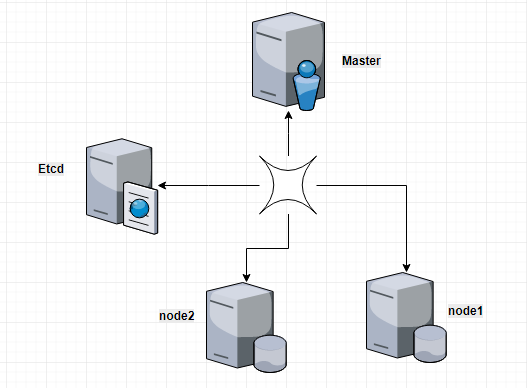
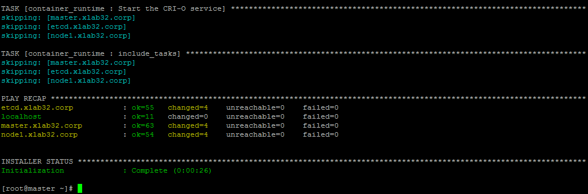
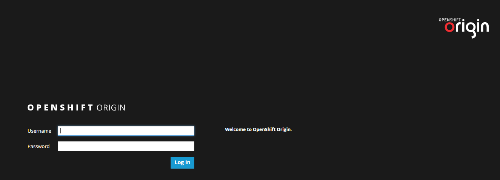

Segundo a Red Hat, Openshift é uma plataforma de aplicativos em containers que oferece as tecnologias Docker e Kubernetes para o ambiente Enterprise.

Independência da arquitetura de aplicativos, o OpenShift permite criar, desenvolver e implantar os aplicativos de forma simples, rápida em qualquer infraestrutura, seja pública ou privada.

Os principais elementos para instalar uma infraestrurura de OpenShift Enterprise são:

- *Master* :  O master pode ser um host ou um conjunto de hosts que contém os componentes 'master' do Openshift, tais como servidor de API,  servidor de controle de gerenciamento e Etcd. O master também gerencia os Nodes através de um cluster de Kubernete e escala os pods para rodar nos nodes.
Hardware recomendado para execução do master:

    |hardware|Configuração|
    |--------|-------------|
    |vCPU	| 2|
    |RAM	|16G|
    |Discos:|
    |/var	|40G|
    |/usr/local/bin	|1G|
    |/	|50G|

- *Etcd* :  O Etcd armazena o estado do master e os outros componentes. Utiliza essa informação para realizar mudança e se tornarem no estado desejado.  O Etcd pode ser opcionalmente configurado para alta disponibilidade.

Hardware recomendado para execução do Etcd:

    |hardware	|Configuração|
    ------------|-------------
    |vCPU	|1|
    |RAM	|8G|
    |Discos:|
    |/	|50G|

- *Nodes*: Os nodes oferece o ambiente para execução dos containers. Cada nó em um cluster Kurnenetes possui os serviços necessários para serem gerenciados pelos master. Os Nodes também possuem serviços necessários para executar pods, tais como Docker, kubelet e um proxy de serviço.

Hardware recomendado para execução do nodes:

|hardware|	Configuração|
---------|---------------|
|vCPU	|1|
|RAM	|8G|
|Discos (/dev/sda):|
|/var	|15G|
|/usr/local/bin|	1G|
|/	|50G|
|Disco (/dev/sdb)|
|docker storage|	50G|

Conforme descrito na listagem de hardware dos nodes, é importante ter um disco ou partição para o storage do docker.



Figura 1 - Servidores do Cluster OpenShift

#Pré-requisitos

Antes de começar a instalar é importante lembrar que o Openshift requer um servidor de DNS para o pleno funcionamento. Adicionando os Masters, Etcd e os Nodes no arquivo de hosts não vai resolver.

Como pré-requisito será necessário instalar os pacotes básicos em todos os hosts envolvidos. Portanto execute os comandos abaixo no Masters, Etcd e Nodes.

```bash
$ yum install -y epel-release
$ yum install -y wget git net-tools bind-utils iptables-services  bridge-utils \
bash-completion ansible docker python-cryptography pyOpenSSL.x86_64
```

O Openshift trabalha com a versão especifica do Docker 1.12, portanto verifique se essa versão está instalada.

Verifique a versão do docker instalado:

```bash
$ docker -v 
  Docker version 1.12
```

Antes de seguir com a instalação,  é necessário ajustar a configuração do docker e para isso altere o arquivo `/etc/sysconfig/docker`, com a seguinte alteração:

```
OPTIONS='--insecure-registry=172.30.0.0/16 --selinux-enabled --log-opt max-size=1M --log-opt max-file=3'
```

Também é necessário em cada nó adicionar o disco extra para o armazenamento do docker, conforme as melhores práticas definido pela RedHat. Nessa documentação estamos considerando que o disco para o docker storage é o /dev/sdb.

Configurando o arquivo `/etc/sysconfig/docker-storage-setup` para definir o disco para storage, em seguida pare a execução do docker, remova o storage da partição /var e execute o docker-storage-setup para mudar o ponto de armazenamento do storage e reinicie o docker.

```bash
$ cat << EOF > /etc/sysconfig/docker-storage-setup
   DEVS=/dev/sdb
   VG=vg-docker
   SETUP_LVM_THIN_POOL=yes
EOF
```

Parando o docker

```bash
$ systemctl stop docker
```

Limpando o storage em diretório

```bash
$ rm -rf /var/lib/docker/*
```

Mudando o docker storage para o disco LVM

```bash
$ docker-storage-setup
```

Iniciando o docker

```bash
$ systemctl start docker
```

Testando o docker

```bash
$ docker ps
```
Também é necessário ajustar o selinux para permitir a escrita dos pods.

```bash
$ setsebool -P virt_sandbox_use_fusefs on
```
Para finalizar os pré-requisitos, é necessário gerar as chaves simétricas do SSH e copiar a chave pública entre todos os servidores para realizar autenticação com a chave. Criei o script abaixo para facilitar esse processo, altere os hosts dos servidores e execute o script.

```bash
#!/bin/bash
hosts=(
        'master.xlab32.corp'  \
        'etcd.xlab32.corp'    \
        'node1.xlab32.corp'   \
        'node2.xlab32.corp'
       )

ssh-keygen -t rsa
for host in "${hosts[@]}"; do
   ssh-copy-id -i ~/.ssh/id_rsa.pub $host;
done
```

Ajuste a permissão para execução.

```bash
$ chmod +x copy_id.sh
```

Digite as senhas quando solicitado.

```bash
$ ./copy_id.sh
```

# Instalação

Na instalação avançada do OpenShift será utilizada os playbooks do Ansible. E para isso é necessário realizar o clone dos playbooks. Os próximos comandos são executados no master.

Clonando o playbook do ansible para openshift-3.8:

```bash
$ git clone https://github.com/openshift/openshift-ansible
```

Para o playbook funcionar é necessário ajustar as configuração do inventário, apontando a infraestrutura que será instalada e os hosts dos servidores.

Criei o arquivo `inventory.erb` com a seguinte estrutura:

```
[OSEv3:children]
#os recursos que serão instalados
masters
nodes
etcd

[OSEv3:vars]
ansible_ssh_user=root
deployment_type=origin
#autenticação será realizada pelo arquivo htpasswd
openshift_master_identity_providers=[{                                           \
                                     'name': 'htpasswd_auth',                    \
                                     'login': 'true',                            \
                                     'challenge': 'true',                        \
                                     'kind': 'HTPasswdPasswordIdentityProvider', \
                                    'filename': '/etc/origin/master/htpasswd'    \
                                    }]
containerized=true
# Se algum recurso, tais como memória, disco não foram atendido, a instalação 
# não será concluída, portanto é necessário desabilitar a verificar para instalar.
#openshift_disable_check=memory_availability,      \
                        disk_availability,         \
                        docker_image_availability, \
                        docker_storage
openshift_clock_enabled=true

#hostname de acesso 
#https://master.xlab32.corp:8443
openshift_public_hostname=master.xlab32.corp
#Subdomínio das aplicações  
openshift_master_default_subdomain=apps.xlab32.corp

[masters]
master.xlab32.corp openshift_schedulable=true

[etcd]
etcd.xlab32.corp

[nodes]
master.xlab32.corp openshift_node_labels="{'region': 'infra', 'zone': 'default'}" openshift_schedulable=true
etcd.xlab32.corp   openshift_node_labels="{'region': 'infra', 'zone': 'default'}" openshift_schedulable=true
node1.xlab32.corp  openshift_node_labels="{'region': 'infra', 'zone': 'default'}" openshift_schedulable=true
node2.xlab32.corp  openshift_node_labels="{'region': 'infra', 'zone': 'default'}" openshift_schedulable=true
```

Após o ajuste no arquivo de `inventory.erb`, vamos executar o playbooks. Primeiramente é executado o playbooks de verificação dos pré-requisitos e logo em seguida o playbook de instalação propriamente dito.

# Verificação do pré-requisitos.

```bash
$ ansible-playbook -i inventory.erb openshift-ansible/playbooks/prerequisites.yml
```

O resultado esperado da execução da verificação dos pré-requisitos, é semelhante a figura 2.


Figura 2 - Resultado do playbook pré-requisitos.

Executando o playbook para instalação do Openshift.

```bash
$ ansible-playbook -i inventory.erb /root/openshift-ansible/playbooks/deploy_cluster.yml
```
# Verificando a instalação

É necessário criar um usuário para acesso ao Openshift. Como definido no arquivo inventory.erb, vamos utilizar o arquivo `/etc/origin/master/htpasswd` para isso. Em um post futuro estarei mostrando como realizar autenticação via LDAP (Active Directory).

```bash
$ htpasswd /etc/origin/master/htpasswd user1
```

Antes de acessar a interface web, é importante validar as configurações do Openshift. Para isso é necessário acessar a console do master.

A primeira ação que deve ser realizada é o login no Openshift. Para isso execute o comando:

```bash
$ oc login -u user1
```
Dessa forma você realizou autenticação com usuário "normal". Caso queria autenticar como administrador, execute o seguinte comando:

```bash
$  oc login -u system:admin
```

Agora você esta autenticado no Openshift como admin e pode executar os outros comandos.

Listar os projetos criados:

```bash
$ oc get project
```

Listar os nodes:

```bash
$ oc get nodes
```

Com o usuário user1,  vamos acessar a url de acesso (definido no arquivo inventory.ebr).


Figura 3 - Tela de autenticação do Openshift.

Agora temos o Openshift instalado e funcional para receber os projetos.

# Uninstall 

O processo para desinstalar o Openshift é bastante simples também:

$ ansible-playbook -i inventory.erb openshift-ansible/playbooks/adhoc/uninstall.yml

# Documentação:

- [OpenShift_Container_Platform-3.7-Installation_and_Configuration-en-US.pdf
](https://access.redhat.com/documentation/en-us/openshift_container_platform/3.7/pdf/installation_and_configuration/OpenShift_Container_Platform-3.7-Installation_and_Configuration-en-US.pdf)

