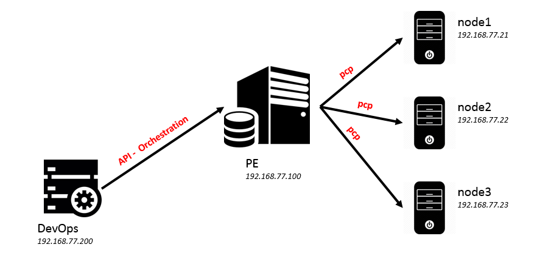
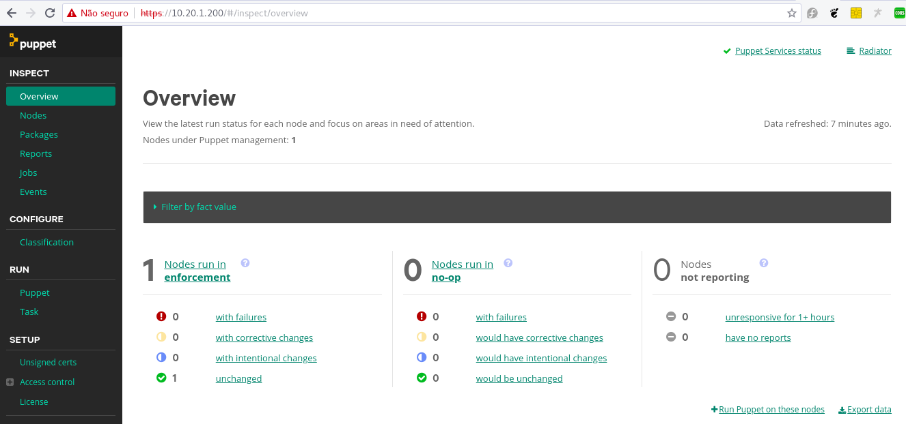
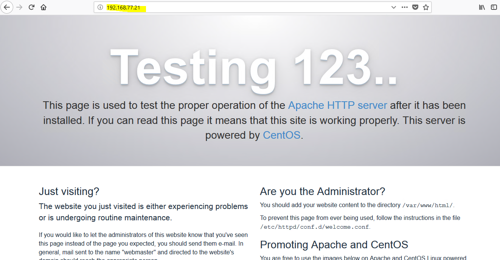
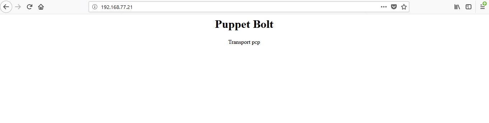
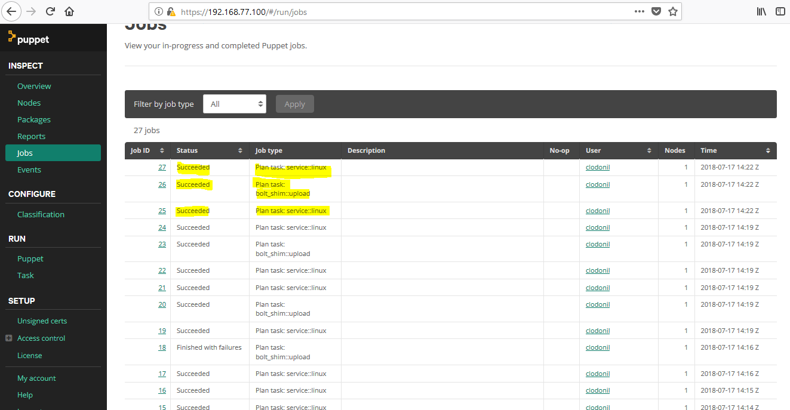

Com o Puppet Task (bolt) é possível executar comandos, tarefas e planos utilizando o agente pcp através do orchestration do Puppet Enterprise.

Utilizar o transporte pcp possui várias vantagens, tais como:

* Acesso administrativo aos nodes do PE;
* Rastreabilidade das tasks pelo console do PE;
* Retorno e mudanças auditavel;
* Acesso aos inventário de host do PE;
* Todo eco-sistema do Puppet Enterprise.


Para entendermos na prática como funciona essa conexão, vamos montar um LAB com a seguinte estrutura.




Para provisionamento dessa infraestrutura, vamos utilizar o vagrant com virtualbox.

Todos os códigos utilizados nesse laboratório estão no seguinte endereço: [https://github.com/clodonil/Puppet_Task_com_PE_Orchestrator.git](https://github.com/clodonil/Puppet_Task_com_PE_Orchestrator.git)

```
$ git clone https://github.com/clodonil/Puppet_Enteprise_com_Bolt.git
```

O arquivo VagrantFile provisiona as vms:

- *nodes*:  Hosts que serão modificados pelo Puppet Tasks;
- *master*: Host que vai ser instalado o Puppet Enterprise;
- *devops*: Host para gerenciar o bolt. Que futuramente poderia se tornar um jenkins;

Segue o arquivo que faz o provisionamento da infra.

```
# -*- mode: ruby -*-
# vi: set ft=ruby :


Vagrant.configure("2") do |config|
  #  Configure base
  config.vm.box = 'centos/7'
  config.ssh.forward_agent = true
  config.ssh.insert_key = false

  # nodes
  $node_count = 2
  (1..$node_count).each do |id|
     config.vm.define "node#{id}" do |nodes|
         nodes.vm.hostname = "node#{id}.vm"
         nodes.vm.network :private_network, :ip => "192.168.77.#{20+id}"
         nodes.vm.provision :hosts, :sync_hosts => true
         # Add nodes in Puppet master
         nodes.vm.provision "shell", inline: "curl -k https://master.vm:8140/packages/current/install.bash | sudo bash"
    end
 end

  # Puppet Enterprise 2018 and Puppet Tasks
  config.vm.define "master" do |master|
      master.vm.hostname = "master.vm"
      master.vm.network :private_network, :ip => "192.168.77.100"
      master.vm.provision :hosts, :sync_hosts => true
      # Start of Vault in mode Dev
      master.vm.provision "shell", path: "./PuppetServer/install.sh"
      master.vm.provider :virtualbox do |setting|
           setting.memory = 4028
           setting.cpus = 2
      end
   end

  # Tools of DevOps
  config.vm.define "devops" do |devops|
      devops.vm.hostname = "devops.vm"
      devops.vm.network :private_network, :ip => "192.168.77.200"
      devops.vm.provision :hosts, :sync_hosts => true
      # Install of Puppet Bolt
      devops.vm.provision "shell", inline: "rpm -ivh http://yum.puppet.com/puppet5/puppet5-release-el-7.noarch.rpm &&  yum -y install puppet-bolt"
   end
end
```

Vamos iniciar o vm `master` do Vagrantfile. É necessário antes de inicializar, fazer download do Puppet Enterprise e colocar dentro do diretório PuppetServer.

Também ajuste a variável "PE" dentro do script install.sh para a versão correta do Puppet Enterprise, dessa forma o Puppet Enterprise será instalado durante o provisionamento.

Inicializando a vm "master".

```
$ vagrant up master
```

Acessando PE via navegados com o seguinte acesso:

> Login: admin

> Senha: redepp




Agora vamos iniciar as vms devops, note1, node2 e node3:

```
$ vagrant up devops node1 node2 node3
```

Durante o provisionamento, será instalado o bolt na vm devops e será enviado a solicitação de inclusão dos nodes no Puppet Enterprise.

Após o provisionamento dos nodes, volte no Puppet Enterprise e aceite a inclusão dos nodes:


Para ativar os recursos de command, file_upload e script no PE é necessário instalar o módulo do Forge:

`mod 'puppetlabs-bolt_shim', '0.1.1'`

A instalação no PE pode ser realizado dessa forma:

```
$ vagrant ssh master
$ sudo su -
$ puppet module install puppetlabs-bolt_shim
```

## 6.1 Puppet Tasks com Orchestrator
Para o Puppet Tasks utilizar o Orchestrator e o canal de comunicação pcp com os nodes, é necessário configurar o bolt para comunicar com a API do orchestrator.

Para isso, crie o arquivo `bolt.yaml` no diretório `/root/.puppetlabs` com o seguinte conteúdo:

```yaml
---
#canal de comunicação pcp
pcp:
  # Comunicação com API do orchestration
  service-url: https://master.vm:8143
  #token de autenticação
  token-file: /root/.puppetlabs/token
  # Ambiente dos módulos
  task-environment: production
  # Certificado de acesso
  cacert: /root/.puppetlabs/ca.pem
```

Para gerar o token, volte no servidor master e crie um token de acesso ao  Puppet Enterprise.

```
$ puppet access login --lifetime 100d
```

O token é gerado `/root/.puppetlabs/token`. Copie esse arquivo para a vm devops.

```
$ echo "AM0exaVrNyDi1aB_xyEvifEWOGlwnt0riBU6x867423hgL" | tr -d '\n' > /root/.puppetlabs/token
```

Feito isso é possível executar as tasks e os plans utilizando o canal de comunicação do pcp.

## 6.2 Executando um Tasks através do Orchestrador

Com a comunicação do bolt como Orchestrador pronta, vamos começar testando a comunicação através da instalação do pacote httpd nos nodes.

```
$ bolt task run package name=httpd action=install -n pcp://node1.vm,pcp://node2.vm,pcp://node3.vm
Started on node1.vm...
Started on node2.vm...
Started on node3.vm...
Finished
  {
    "status": "present",
    "version": "2.4.6-80.el7.centos.1"
  }
Successful on 3 nodes: pcp://node1.vm,pcp://node2.vm,pcp://node3.vm
Ran on 3 nodes in 36.04 seconds
```

Agora temos o servidor httpd instalado em todos os nodes. Vamos agora iniciar o servidor web utilizando uma tasks. Vamos iniciar apenas no node1:

```
$ bolt task run service::linux name=httpd action=start --nodes pcp://node1.vm
Started on node1.vm...
Finished on node1.vm:
  {
    "status": "httpd start"
  }
Successful on 1 node: pcp://node1.vm
```

Vamos avançar com os testes e para isso será criado um módulo chamado 'generic' no PE e dentro dela vamos criar as tasks. Essas tasks serão gerenciadas pelo bolt.

No servidor master, crie o módulo 'generic' dentro do enviroment production e também o diretório tasks dentro do generic:

```
mkdir -p /etc/puppetlabs/code/environments/production/modules/generic/tasks
```

A primeira tasks que vamos criar será para listar o conteúdo do diretório passwd.

```
#!/bin/bash
cat /etc/passwd
```
Vamos executar a tasks através do bolt no host devops, vamos executar apenas no node1:

```
$ bolt task run generic::passwd -n pcp://node1.vm
Started on node1.vm...
Finished on node1.vm:
  root:x:0:0:root:/root:/bin/bash
  bin:x:1:1:bin:/bin:/sbin/nologin
  daemon:x:2:2:daemon:/sbin:/sbin/nologin
  adm:x:3:4:adm:/var/adm:/sbin/nologin
  lp:x:4:7:lp:/var/spool/lpd:/sbin/nologin
  sync:x:5:0:sync:/sbin:/bin/sync
  shutdown:x:6:0:shutdown:/sbin:/sbin/shutdown
  halt:x:7:0:halt:/sbin:/sbin/halt
  mail:x:8:12:mail:/var/spool/mail:/sbin/nologin
  operator:x:11:0:operator:/root:/sbin/nologin
  games:x:12:100:games:/usr/games:/sbin/nologin
  ftp:x:14:50:FTP User:/var/ftp:/sbin/nologin
  nobody:x:99:99:Nobody:/:/sbin/nologin
  systemd-network:x:192:192:systemd Network Management:/:/sbin/nologin
  dbus:x:81:81:System message bus:/:/sbin/nologin
  polkitd:x:999:998:User for polkitd:/:/sbin/nologin
  rpc:x:32:32:Rpcbind Daemon:/var/lib/rpcbind:/sbin/nologin
  rpcuser:x:29:29:RPC Service User:/var/lib/nfs:/sbin/nologin
  nfsnobody:x:65534:65534:Anonymous NFS User:/var/lib/nfs:/sbin/nologin
  sshd:x:74:74:Privilege-separated SSH:/var/empty/sshd:/sbin/nologin
  postfix:x:89:89::/var/spool/postfix:/sbin/nologin
  chrony:x:998:996::/var/lib/chrony:/sbin/nologin
  vagrant:x:1000:1000:vagrant:/home/vagrant:/bin/bash
  apache:x:48:48:Apache:/usr/share/httpd:/sbin/nologin
  {
  }
Successful on 1 node: pcp://node1.vm
Ran on 1 node in 4.74 seconds
```
Dessa forma validamos que a tasks está sendo executada corretamente e mais importante que o bolt está com acesso aos módulos do PE. Agora vamos criar uma outra tasks com o nome shadow. Basicamente nesse caso vamos validar que a tasks está sendo executada com privilégios e também mostrar o poder/riscos que temos na mão.

```
#!/bin/bash
cat /etc/shadow
```
executando a tasks.

```
$ bolt task run generic::shadow -n pcp://node1.vm
Started on node1.vm...
Finished on node1.vm:
  root:$1$VEt.WqKC$CamA1Xh1GBbWpR1YkSJR1/::0:99999:7:::
  bin:*:17632:0:99999:7:::
  daemon:*:17632:0:99999:7:::
  adm:*:17632:0:99999:7:::
  lp:*:17632:0:99999:7:::
  sync:*:17632:0:99999:7:::
  shutdown:*:17632:0:99999:7:::
  halt:*:17632:0:99999:7:::
  mail:*:17632:0:99999:7:::
  operator:*:17632:0:99999:7:::
  games:*:17632:0:99999:7:::
  ftp:*:17632:0:99999:7:::
  nobody:*:17632:0:99999:7:::
  systemd-network:!!:17663::::::
  dbus:!!:17663::::::
  polkitd:!!:17663::::::
  rpc:!!:17663:0:99999:7:::
  rpcuser:!!:17663::::::
  nfsnobody:!!:17663::::::
  sshd:!!:17663::::::
  postfix:!!:17663::::::
  chrony:!!:17663::::::
  vagrant:$1$xyskNOHy$fTX23HILCqtay.zv8cRaN.::0:99999:7:::
  apache:!!:17729::::::
  {
  }
Successful on 1 node: pcp://node1.vm
Ran on 1 node in 4.37 seconds
```

E para finalizar a execução das tasks, vamos criar a task chamado opendoor.sh para listar as portas que estão abertas no servidor:

```
#!/bin/bash
ss -ant | grep LISTEN
```

Vamos utilizar o modulo "generic" com a task opendoor para verificar se a porta 80 está aberta.

```
$ bolt task run generic::opendoor -n pcp://node1.vm
Started on node1.vm...
Finished on node1.vm:
  LISTEN     0      128          *:111                      *:*
  LISTEN     0      128          *:22                       *:*
  LISTEN     0      100    127.0.0.1:25                       *:*
  LISTEN     0      128         :::111                     :::*
  LISTEN     0      128         :::80                      :::*
  LISTEN     0      128         :::22                      :::*
  LISTEN     0      100        ::1:25                      :::*
  {
  }
Successful on 1 node: pcp://node1.vm
Ran on 1 node in 1.99 seconds
```

Você pode abrir o navegado com o ip do node1 para verificar que o servidor está de fato rodando.




## Consultando Nodes no PuppetDB

É possível gerar uma lista de nodes do PuppetDB para ser utilizado no inventário. Para isso altere o arquivo "bolt.yaml", acrescentando a conexão para o PuppetDB.

```yaml
puppetdb:
    server_urls: https://master.vm:8081
    cacert: ~/.puppetlabs/ca.pem
    # Use cert+key for FOSS PuppetDB
    cert: ~/.puppetlabs/master.vm.pem
    key:  ~/.puppetlabs/master.vm.key
    # Use a token for PE PuppetDB
    token: ~/.puppetlabs/token
```

Os certificados podem ser obtidos no servidor master.

Exemplo de utilização vamos executar o comando 'hostname' em todos os nodes do PE.

```
$  bolt command run hostname --transport pcp  --query 'nodes[certname] { }'
Started on master.vm...
Started on node1.vm...
Started on node2.vm...
Finished on master.vm:
  STDOUT:
    master.vm
Finished on node1.vm:
  STDOUT:
    node1.vm
Finished on node2.vm:
  STDOUT:
    node2.vm
Successful on 3 nodes: master.vm,node1.vm,node2.vm
```
Podemos utilizar facts como parte do filtro:

```
$ bolt command run 'ls -l /etc/' --tranport pcp  --query 'inventory {facts.kernel = "Linux"}'
```

## Executando um Plan através do Orchestrador
Puppet Enterprise (PE) ainda não tem suporte ao recurso do Plan, em planejamento para as próximas versões. Para executar os plan é necessário criar localmente, no host devops, e utilizar o pcp para enviar para os nodes.

Ajuste o arquivo `bolt.yaml` adicionando o diretório do module.

```yaml
---
modulepath: /root/modules
pcp:
  service-url: https://master.vm:8143
  token-file: /root/.puppetlabs/token
  task-environment: production
  cacert: /root/.puppetlabs/ca.pem
puppetdb:
    server_urls: https://master.vm:8081
    cacert: ~/.puppetlabs/ca.pem
    # Use cert+key for FOSS PuppetDB
    cert: ~/.puppetlabs/master.vm.pem
    key:  ~/.puppetlabs/master.vm.key
    # Use a token for PE PuppetDB
    token: ~/.puppetlabs/token
```

No diretório  '/root/modules', crie o web/plans.

```
$ mkdir -p /root/modules/web/plans
```

Basicamente vamos fazer um 'plan' para atualizar os servidores web.

Para isso vamos criar dentro do diretório plans o arquivo deploy.pp:

```
plan web::deploy(
TargetSpec $webserver,
) {
  $node="pcp://${webserver}"
  # Stop webservice
  $result=run_task('service::linux', $node,  name => 'httpd', action => 'stop')
  if ($result.ok) {
    file_upload('web/site.html','/var/www/html/index.html',$node)
    run_task('service::linux', $node,  name => 'httpd', action => 'start')
    notice("Deploy finalizado com sucesso!!!")
  }
}
```
basicamente esse 'plan' executa as seguintes tarefas:

- Para (stop) o servidor web;
- Copia o arquivo files/site.html para o diretório que está dentro diretório /var/www/html/index.html;
- Inicia (start) o servidor web;

Perceba que o 'TargetSpec $webserver' é o parâmetro que deve ser passado com o nome do servidor web.

## Para executar esse plano:

```
bolt plan run web::deploy webserver=node1.vm
Starting: task service::linux on pcp://node1.vm
Finished: task service::linux with 0 failures in 2.32 sec
Starting: file upload from /root/modules/web/files/site.html to /var/www/html/index.html on pcp://node1.vm
Finished: file upload from /root/modules/web/files/site.html to /var/www/html/index.html with 0 failures in 1.76 sec
Starting: task service::linux on pcp://node1.vm
Finished: task service::linux with 0 failures in 1.79 sec
Deploy finalizado com sucesso!!!
Plan completed successfully with no result
```

Agora vamos melhorar o arquivo de deploy para fazer o procedimento para todos os servidores com um determinado query.

Vamos criar o deplotall.pp:

```
plan web::deployall {
  # Consulta no PuppetDB
  $result_db = puppetdb_query("inventory {facts.kernel = 'Linux'}")
  $names = $result_db.map |$r| { $r["certname"] }
  $nodes = $names.map |$n| { "pcp://${n}" }

  # Stop webservice
  $result=run_task('service::linux', $nodes,  name => 'httpd', action => 'stop')
  if ($result.ok) {
    file_upload('web/site.html','/var/www/html/index.html',$nodes)
    run_task('service::linux', $nodes,  name => 'httpd', action => 'start')
    notice("Deploy finalizado com sucesso!!!")
  }
}
```
Nesse caso os nodes estão vendo pesquisados de acordo o sistema operacional no PuppetDB do servidor. Mais nada impede utilizar outros critérios ou fatos.

```
$ bolt plan run web::deployall
Starting: task service::linux on pcp://node2.vm, pcp://node1.vm, pcp://master.vm
Finished: task service::linux with 0 failures in 2.28 sec
Starting: file upload from /root/modules/web/files/site.html to /var/www/html/index.html on pcp://node2.vm, pcp://node1.vm, pcp://master.vm
Finished: file upload from /root/modules/web/files/site.html to /var/www/html/index.html with 0 failures in 1.9 sec
Starting: task service::linux on pcp://node2.vm, pcp://node1.vm, pcp://master.vm
Finished: task service::linux with 1 failure in 1.9 sec
```

Pode verificar pelo navegador que o servidor web de fato está rodando:




Um ponto bastante relevante de utilizar o bolt através do Puppet Enterprise é a parte de auditoria e rastreabilidade. No console do Puppet Enterprise, na aba 'jobs" é possível acompanhar todas as tasks executadas.




# Referência

-[https://puppet.com/docs/bolt/0.x/bolt.html](https://puppet.com/docs/bolt/0.x/bolt.html)
-[https://github.com/puppetlabs/bolt](https://github.com/puppetlabs/bolt)