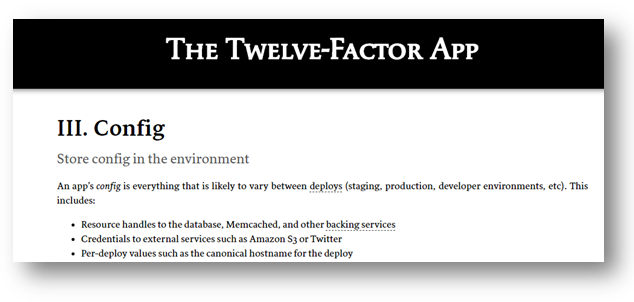
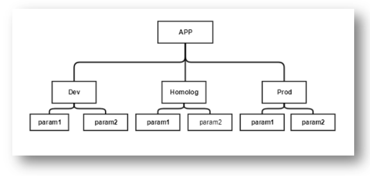
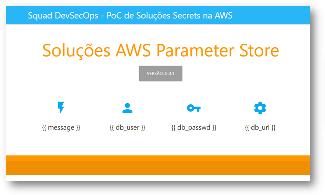
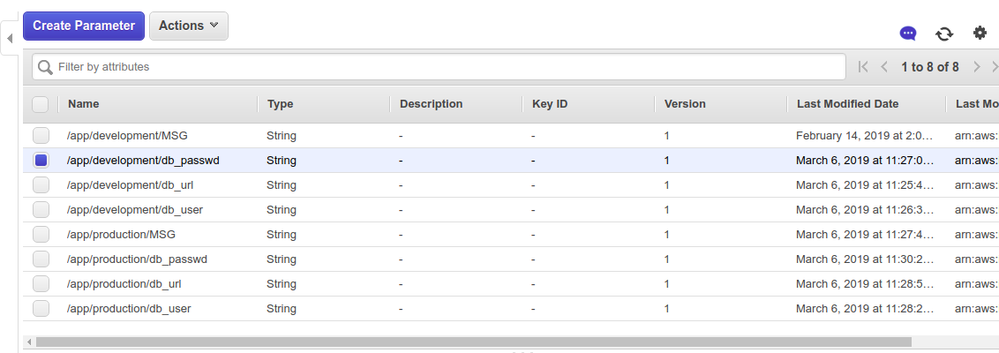
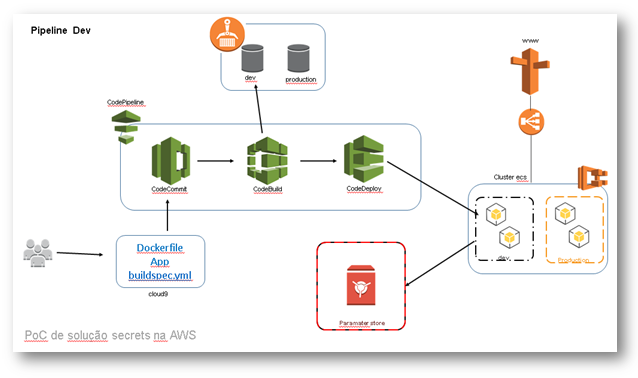
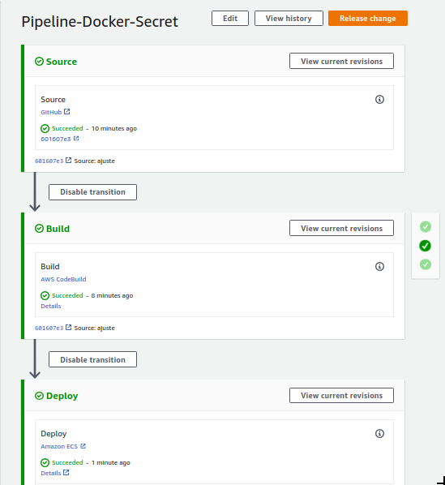

No desenvolvimento de uma aplicação moderna a única coisa que deve mudar entre os deploys nos ambientes development, homolog e poduction são as configurações. A gestão de configurações é um capítulo importante nos [12facter](https://12factor.net/pt_br/config).



Os sistemas que armazenam os acesso a banco de dados ou outros configurações diretamente no seu código, está violando os 12fatores.

Apenas as configurações que mudam durante o deploy devem ser gerenciadas, portanto configurações como `router` ou qualquer outra configuração que não mudam durante o deploy, não devem estar na gestão de configuração.

A aplicação 12fatores armazena configuração em variáveis de ambiente (env). EnvS são fáceis de mudar entre deploys sem alterar qualquer código; ao contrário de arquivos de configuração, há pouca chance de serem colocados acidentalmente no repositório do código; e ao contrário dos arquivos de configuração personalizados, ou outros mecanismos de configuração, eles são por padrão agnósticos a linguagem e ao SO.

No modelo de configuração, precisamos armazenar os dados em um sistema centralizado, que permita que os dados sejam estruturados, para uma recuperação de dados em uma única chamada.
 
Esse sistema que armazena os dados também devem permitir o armazenamento de segredos (secret) e tudo com controle de acesso, log e auditoria.



Na AWS temos 2 serviços que atendem esses critérios e são exclusivamente para armazenamento de dados de configurações.

São eles:

AWS Parameter Store
 * [AWS – Documentação](https://docs.aws.amazon.com/pt_br/systems-manager/latest/userguide/systems-manager-paramstore.html)
 * [AWS - Guia](https://docs.aws.amazon.com/pt_br/systems-manager/latest/userguide/systems-manager-paramstore.html)
 * [AWS - The Right Way to Store Secrets using Parameter Store](https://aws.amazon.com/pt/blogs/mt/the-right-way-to-store-secrets-using-parameter-store/)

AWS Secrets Manager
 * [AWS – Documentação](https://aws.amazon.com/pt/secrets-manager/)
 * [AWS - Guia](https://docs.aws.amazon.com/pt_br/secretsmanager/latest/userguide/intro.html)

É importante reforçar que estamos falando dos serviços AWS, não estou falando de serviços montandos em cima de EC2 (Vault na AWS)

## Parameter Store

O Parameter Store (ssm) permite armazenamento de chave/valor estruturado ele contém as seguintes caracteristica:

- Gerencie o acesso com políticas detalhadas;
- Gerenciamento escalável de dados de configuração;
- Gerenciamento escalável de segredos;
- Armazena dados em hierarquias e versões de trilha;
- Controla e audita o acesso em níveis específicos.
- Log, Auditoria e Monitoramento;
- Integração com Codebuild, Codedeoploy...

Definição de preço
sem custo adicional;

## Secret Manager

O Secret Manager é mais elaborado que o `Parameter Store`, com integração com os sistemas de RDB permite fazer rotacionamento de senhas e alteração automática das senhas.

- Gerencie o acesso com políticas detalhadas;
- chaves de criptografia;
- Log, Auditoria e Monitoramento;
- Integração com RDB;
- Politica de rotação e expiração  de segredos;
- Rotação de senhas automaticamente;
- Conformidade  com o HIPAA, PCI e ISO;

Definição de preço

0,40 USD por segredo por mês;
0,05 USD por 10.000 chamadas de API.


## laboratório/PoC 

Para o desenvolvimento desse laboratório, usei como base a documentação da AWS ["the right way to store secrets using parameter store"](https://aws.amazon.com/pt/blogs/mt/the-right-way-to-store-secrets-using-parameter-store/) que descreve a melhor forma de aplicar o "Parameter Store" em um container.

Vamos começar o laboratório com aplicação ('Hello Word') que basicamente busca as informações do 'Parameter Store'. O aplicativo foi desenvolvido em Python (Flask) para validação de variável de ambiente e secret's em containner para AWS.

Clone o projeto do [código fonte](https://github.com/kledsonhugo/docker-secret-aws.git) para validar localmente.

```bash
$ git clone https://github.com/kledsonhugo/docker-secret-aws.git
```

Build da imagem:

```bash
$ docker build -t docker-secret-aws:latest .
```

Executando app:

```bash
$ docker run -d -p 8080:8080 docker-secret-aws:latest
```

Validando variável de ambiente:

```bash
$ docker run -d -p 8080:8080 -e ENVIRONMENT='Development' -e MSG="Ola Mundo!!!" docker-secret-aws:latest
```
Para validar acesse o navegador para validar:



Se tudo funcionou perfeitamente até aqui, podemos passar a AWS e colocar a nossa aplicação na AWS.

### Criando os parâmetros no SSM na AWS.

Vamos começar na AWS preenchendo os dados no Parameter Store.

Pode ser preenchido via painel da AWS..



Também pode ser preenchido pelo `aws-cli`.

```
$ aws ssm put-parameter --name /app/homolog/MSG --value "Olá Mundo em Homolog" --type String --key-id "alias/aws/ssm" --region us-east-1
```

### Infra: registry ECR e Clutser ECS

Para o desenvolvimento da Pipeline na AWS, vamos primeiramente criar da infraestrutura.



A infraestrutura consiste basicamente em criar 2 repositório do ECR para armazenamento das imagens docker.

Além do repositório também é necessário a criação de um Cluster Fargate. Na criação do serviços do Cluster ECS é necessário a definição das variáveis de ambiente (environment) para cada ambiente.

### Pipeline

A última parte desse documento é demostrar a pipeline que foi desenvolvida para a validação das gestão de configuração.


